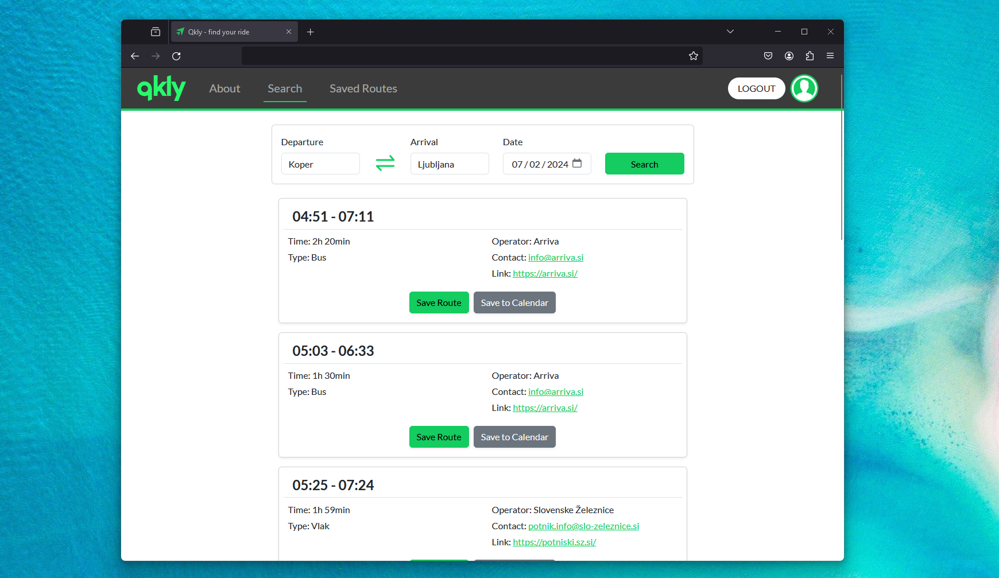

# QKLY - find your ride
## Overview
Qkly(quickly) is a full-stack web application that combines buses, trains, and ridesharing apps into one unified platform. This project was developed as part of the Systems 3 - Information Systems class to demonstrate a comprehensive understanding of building information systems.

## Access
It's currently under development and will be available soon.
  

## Features
- **🔎Unified Search:** Easily search for rides across buses, trains, and ridesharing services from a single platform.
  
- **🛤️Multi-Modal Integration:** Seamless integration of multiple transportation modes for a comprehensive travel solution.

- **🔑User Authentication:** User authentication system to manage user accounts and allows users to save their routes for faster access(Changing password is available).

- **💾Save Routes for Faster Access:** Logged-in users can save their preferred routes to their accounts for quick and easy access in the future.

- **📅Export Routes to ICS:** Logged-in users can export selected routes to ICS files, allowing integration with their calendars for easy scheduling and reminders.

- **📱Responsive Design:** The application is designed to be accessible and user-friendly on various devices, including desktops, tablets, and smartphones. (Hopefully)

## Technologies Used

- **Frontend:**
  - React.js⚛️
  - Bootstrap🅱️
  
- **Backend:**
  - Node.js
  - Express.js
  - MySQL
  - [ical.js](https://www.npmjs.com/package/ical) and [tempfile](https://www.npmjs.com/package/tempfile) libraries (npm)

## Comming in the future

- [ ] **Password reset emails/registration confirmation:** Another layer of security.
- [ ] **Improved design:** It has to look AMAZING.
- [ ] **Web scraper:** Periodic website scraping will ensure updates for the latest routes.
- [ ] **Offer a ride:** Will add an option for users to offer their ride to others(carpooling/ridesharing).
- [ ] **Profile pictures:** Users will be able to add their profile picture.
- [ ] **Phone number linked to user:** For users to get reminders or to contact the one offering ride.
- [ ] **More cities:** More cities to choose from.
- [ ] **Map:** A compact map feature visually illustrates the route's destination and route itself for enhanced user navigation.
  
